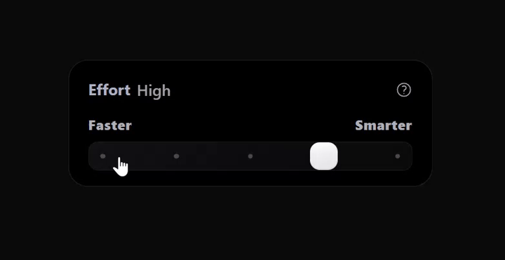

# Claude Range Slider

An effort-level range slider with a real-time WebGL2 fire animation, rebuilt in React and TypeScript. When the slider reaches its maximum ("Ultracode"), a GPU-rendered flame ignites along the track and the status label flips up into view.

This is a React + TypeScript + Tailwind CSS reimplementation inspired by the effort-level slider UI found in Claude Code by [Anthropic](https://www.anthropic.com).

---

## Demo



---

## Features

- **WebGL2 fire animation** — A four-pass render pipeline (fire simulation, horizontal blur, vertical blur, tone-mapped composite) drawn directly onto a canvas in screen blend mode.
- **Snap-to-stop slider** — The thumb snaps to five discrete stops (Flow, Lite, Pro, Max, and Ultracode), each aligned precisely with a track dot.
- **Smooth drag animation** — When dragging, the slider moves fluidly; on release, it smoothly animates to the nearest stop.
- **Idle-aware render loop** — The animation loop automatically suspends after a period of inactivity to conserve resources, and resumes when the slider becomes active.
- **Context-loss recovery** — WebGL programs and framebuffers are rebuilt automatically if the GPU context is lost and restored.
- **Squircle clipping** — Card and track use SVG `clipPath` squircle geometry for smoothly rounded corners.

---

## Technology Stack

| Technology | Role |
|------------|------|
| **TypeScript** | Primary language; strict mode enabled |
| **React** | UI framework; functional components and Hooks |
| **Tailwind CSS** | Utility-first styling (v4 via the Vite plugin) |
| **Vite** | Build tool and development server |
| **Node.js** | Runtime environment |
| **WebGL2** | GPU-accelerated fire rendering |

---

## Getting Started

Install dependencies and start the development server:

```bash
npm install
npm run dev
```

Then open the local URL printed in the terminal (default `http://localhost:1313`).

To create a production build:

```bash
npm run build
npm run preview
```

---

## Project Structure

```
claude-range-slider/
├── src/
│   ├── components/
│   │   └── EffortCard/
│   │       ├── EffortCard.tsx      # Presentation: layout, styles, markup
│   │       ├── hooks/
│   │       │   ├── useSliderState.ts  # Slider value, labels, flip animation
│   │       │   └── useWebglFire.ts    # WebGL2 engine and render loop
│   │       └── shaders/
│   │           └── index.ts       # GLSL shader source strings
│   ├── App.tsx
│   ├── main.tsx
│   ├── index.css
│   └── vite-env.d.ts
├── public/
│   ├── demo.gif
│   ├── demo.mp4
│   ├── favicon.png
│   └── favicon.svg
├── index.html
├── package.json
├── vite.config.ts
└── tsconfig.json
```

---

## How It Works

The component separates concerns across three units:

1. **`EffortCard.tsx`** handles presentation only — layout, styles, the squircle clip paths, the status label, and the masked canvas layer.
2. **`useSliderState.ts`** is pure UI logic — it derives the status label from the slider value and triggers the flip-up animation when the value crosses the Ultracode threshold.
3. **`useWebglFire.ts`** owns the WebGL2 engine — it compiles shaders, manages framebuffers, runs the four-pass render loop, and cleans up all GPU resources on unmount.

The fire effect renders into off-screen framebuffers using a ping-pong technique: each frame feeds the previous frame back into the simulation so embers decay over time, then the result is blurred and composited to the screen.

---

## Status Labels

| Value Range | Label |
|-------------|-------|
| 0-20% | Flow |
| 20-40% | Lite |
| 40-60% | Pro |
| 60-80% | Max |
| 80-100% | Ultracode |

When the slider reaches 80% or higher, the WebGL2 fire animation activates and the status label flips up.

---

## Attribution

The visual design, animation behavior, and WebGL rendering pipeline are heavily inspired by the effort-level slider UI in Claude Code by [Anthropic](https://www.anthropic.com). This implementation is original code written from scratch; it does not copy any third-party source.

---

## Contact

- Email: astraeuszhao@gmail.com

---

## License

[GPL-2.0-only License](../LICENSE) &copy; 2026 Astraeus
