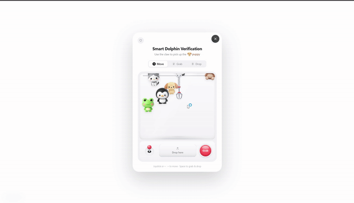

# Smart Dolphin Verification

Smart Dolphin Verification is a reusable human-verification package combining a PlayCaptcha claw-machine interaction with an ALTCHA proof-of-work backend check.



[Download the MP4 demo](./public/demo.mp4)

The visual layer stays playful, while the backend performs signed challenge verification, expiration checks, rate limiting and one-time replay protection.

## Features

- Minimal white demo page with a single login button
- Reusable React verification component
- Reusable TypeScript SDK
- Go backend reference API
- Redis-backed rate limiting and replay prevention
- Fully English user interface

## API

API base URL:

```text
https://api.smartdolphin.top
```

Challenge endpoint (complete URL):

```text
GET https://api.smartdolphin.top/api/chat/challenge
```

Verification endpoint (complete URL):

```text
POST https://api.smartdolphin.top/api/chat/verify
Content-Type: application/json

{
  "payload": "<base64 encoded Smart Dolphin Verification payload>"
}
```

Successful verification response:

```json
{
  "ok": true
}
```

Failed verification response:

```json
{
  "ok": false,
  "error": "verification_failed"
}
```

## SDK Usage

```ts
import { createSmartDolphinVerification } from './src/sdk/smartDolphinVerification';

const payload = await createSmartDolphinVerification({
  apiBase: 'https://api.smartdolphin.top',
  challengePath: '/api/chat/challenge',
});
```

Send `payload` to your protected backend endpoint. The receiving backend should verify it with the Go logic in `backend/main.go` or an equivalent implementation.

## React Component

```tsx
import { SmartDolphinVerification } from './src/components/SmartDolphinVerification';

<SmartDolphinVerification
  open={open}
  onClose={() => setOpen(false)}
  onVerified={(payload) => submitLogin(payload)}
  onError={(message) => setError(message)}
/>
```

## Backend Environment

The backend intentionally does not ship Redis. Each service owner connects their own Redis instance.

```env
LISTEN_ADDR=127.0.0.1:18080
REDIS_ADDR=127.0.0.1:6379
REDIS_PASSWORD=
ALTCHA_SECRET=change-this-secret
ALTCHA_KEY_SECRET=change-this-key-secret
```

## Development

```bash
npm install
npm run dev
```

Open `http://localhost:1313`.

## Build

```bash
npm run build
```

## Backend Run

```bash
cd backend
go mod tidy
go run .
```

## License

GPL-2.0-only
